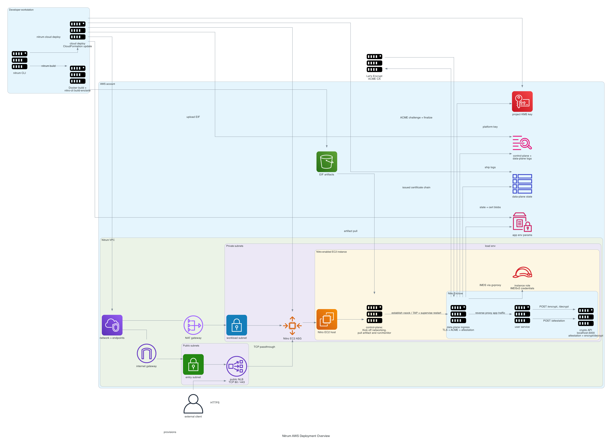
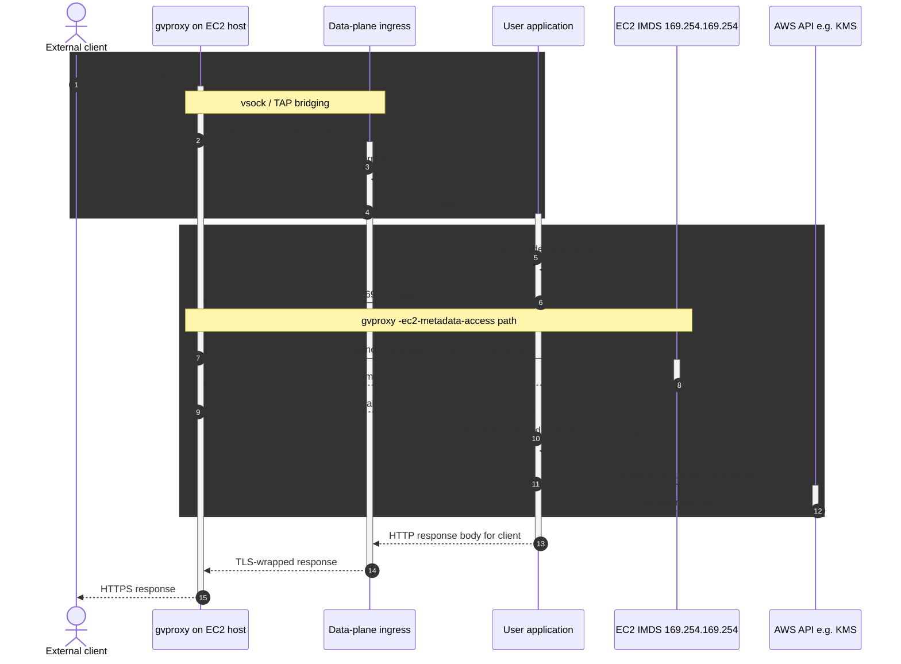
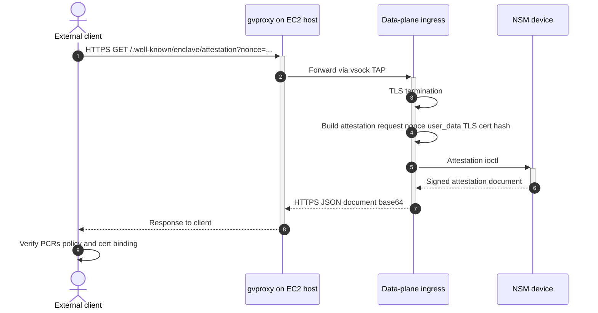
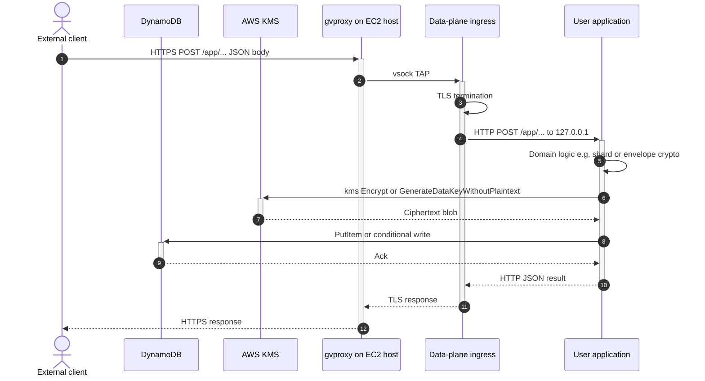
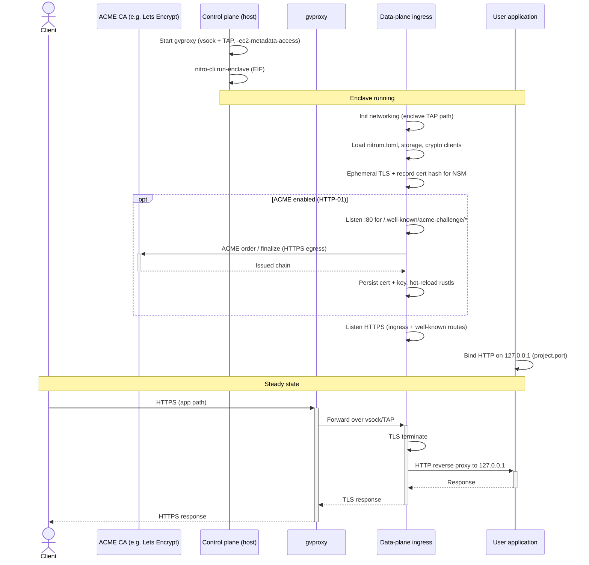
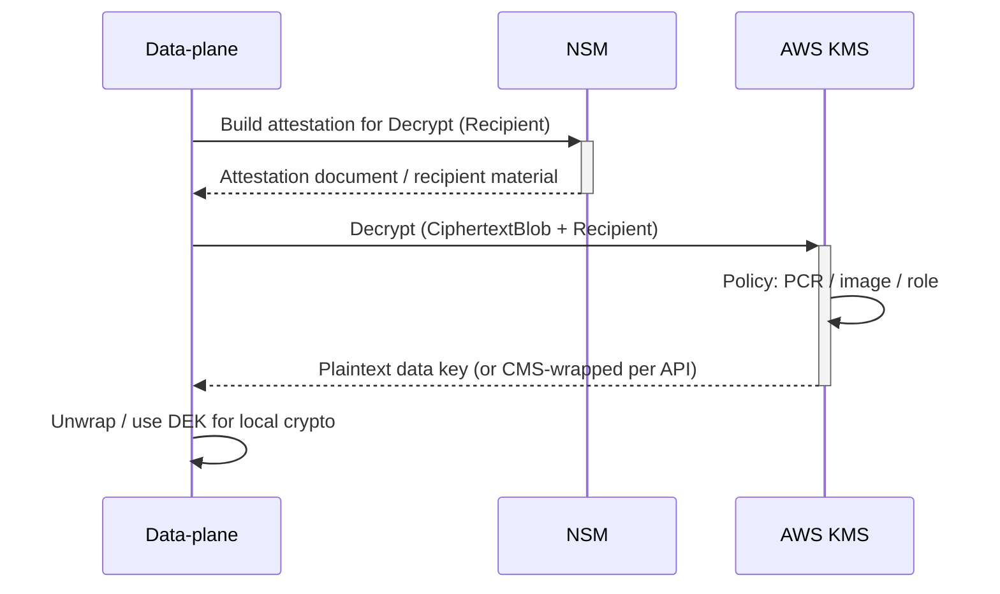
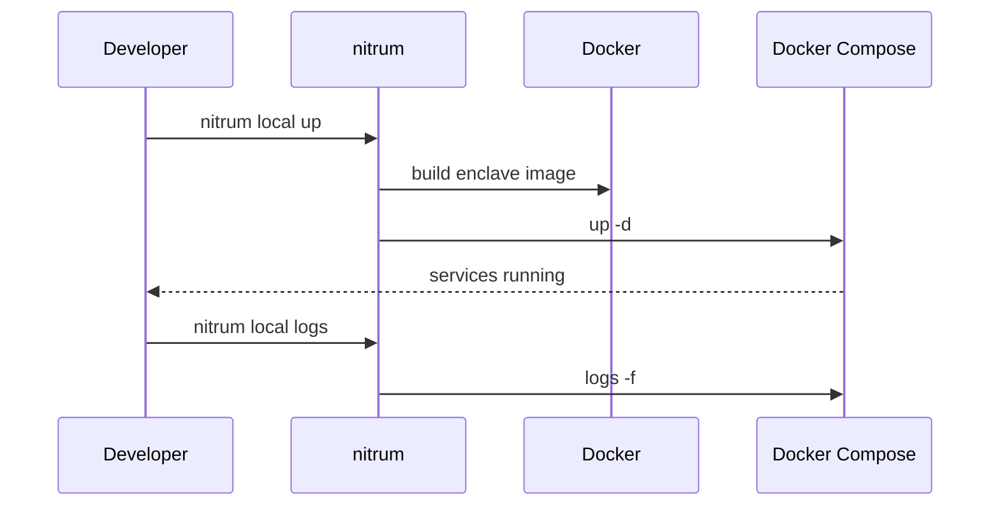
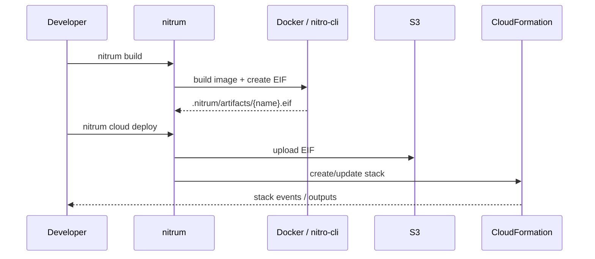

# Architecture

Nitrum is a Rust workspace for building and running workloads in AWS Nitro Enclaves, with a CLI for local development, enclave builds, and CloudFormation-based deployment. This document explains how the platform achieves TLS termination inside the enclave, how TLS certificates and encryption keys are stored and synchronized , which APIs the data-plane exposes, how secrets are handled, and how the CLI deploy flow ties everything together.

The generated diagrams used in this document are stored in `docs/diagrams/output/` and can be refreshed with `make docs-diagrams`.

## Workspace layout

| Crate / area                  | Role                                                                                                                                                                |
| ----------------------------- | ------------------------------------------------------------------------------------------------------------------------------------------------------------------- |
| `cli` crate / `nitrum` binary | User-facing commands: `init`, `build`, `local`, `cloud deploy`, `cloud destroy`, `cloud env`, `cloud logs`, `describe`. Orchestrates Docker, Compose, and AWS APIs. |
| `control-plane`               | Runs on the parent EC2 instance: gvisor-tap-vsock (`gvproxy`) for TAP/VSOCK networking and nitro-cli to start the enclave with the EIF.                             |
| `data-plane`                  | Runs inside the enclave: loads `nitrum.toml`, wires storage/crypto, runs TLS and HTTP ingress, and hosts the application process.                                   |
| `config`                      | Shared configuration types (for example `nitrum.toml` deserialization).                                                                                             |

### Module layout (by crate)

| Crate | Notable modules |
| ----- | --------------- |
| `config` | `sections/` (`project`, `runtime`, `health_check`, `scaling`, `cloud`, `tls_termination`, `egress`), `platform` (`PlatformLayout` for SSM/S3/CFN paths), `artifact` (EIF naming conventions) |
| `cli` | `artifact/` (build, describe), `cloud/`, `storage/`, `local/`, `project/` (`CliProject`), `commands/` |
| `control-plane` | `bootstrap/` (orchestration, config), `enclave/` (supervisor, nitro-cli), `networking/` (gvproxy, forwarder), `storage/` |
| `data-plane` | `bootstrap/` (config, IMDS, SSM), `networking/` (tap, vsock, forwarding), `ingress/` (TLS, ACME), `crypto/`, `storage/`, `egress/`, `runner/` |

## High-level system context

In production, an EIF (enclave image file) built from your project is uploaded to S3, the control-plane  pulls it and starts the enclave. Traffic reaches the data-plane inside the enclave according to your networking and TLS settings.

How to read the deployment overview:

- The **left side** shows developer workflows (`nitrum build`, then `nitrum cloud deploy`) that produce and publish an EIF.
- The **center** shows AWS infrastructure managed by the stack: VPC networking, NLB, EC2 Auto Scaling, KMS, DynamoDB, SSM, and CloudWatch.
- The **right inner cluster** represents one Nitro-enabled EC2 instance with host control-plane stages: artifact download, `gvproxy` networking bootstrap, and enclave supervision/restart handling.
- The **ACME edge between enclave ingress and Let's Encrypt** highlights that certificate issuance is initiated from inside the enclave data-plane.
- The **user service -> crypto API edges** show enclave-local calls used by your app for attestation and encryption/decryption operations.
- The **arrows from enclave services to KMS/DynamoDB/SSM/CloudWatch** represent runtime platform responsibilities (key management, durable state and cert persistence, env loading, and logs).
- The **client -> NLB -> host -> enclave path** shows the external request entry path before request routing reaches your app.

Conceptually:

- The control-plane is responsible for “wiring the world”: Nitro, networking, metadata access, and starting the enclave.
- The data-plane is responsible for “owning secrets and TLS”: cert provisioning, attestation documents, KMS-based keys, and request routing to your app.

## Control plane vs data plane

The control-plane stays on the host: it manages gvproxy (VSOCK, TAP, port forwards, EC2 metadata path) and uses nitro-cli to run and monitor the enclave. The data-plane runs inside the enclave with restricted access; it initializes crypto and storage (KMS, DynamoDB, etc., depending on configuration), serves HTTPS, and runs your command (for example `node /app/src/main.js`).

## Control-plane and data-plane (detailed)

In Nitrum the `data-plane` crate: `ingress/server.rs` terminates TLS, always exposes `/.well-known/enclave/status` and `/.well-known/enclave/attestation`, drives ACME HTTP-01 when enabled, and reverse-proxies everything else to your process on `127.0.0.1` and `project.port` from `nitrum.toml`. The control-plane crate kicks it all off, downloads the artifacts, runs gvproxy and nitro-cli; it does not terminate application HTTPS.

### TLS termination, certificate storage, and sync

- HTTPS (443) is served by the data-plane ingress using rustls. Traffic from the Internet hits the EC2 host, gvproxy forwards it over vsock/TAP into the enclave, and the ingress router handles TLS.
- Self-signed bootstrap: On startup, `TlsState` builds an ephemeral server config for the configured domain and records a hash of the certificate used when minting attestation documents (see below). This allows the enclave to answer HTTPS and attestation requests before a real ACME certificate exists.
- ACME (`[tls_termination] acme = true`):
  - A dedicated HTTP listener (HTTP-01) serves `/.well-known/acme-challenge/*`.
  - The ACME client in `ingress/acme/` talks to Let’s Encrypt (or Pebble in local dev) over HTTPS using normal egress.
  - When a certificate is issued, the certificate chain and private key are encrypted with a data-plane encryption key (see KMS section) and stored in a durable backend (for example S3 or DynamoDB) under a key derived from the project name and domain.
  - The ingress layer hot‑reloads rustls with the new certificate without restarting the enclave.
- Cross-instance sync: On subsequent boots or across additional replicas, the data-plane:
  - Looks up the stored, encrypted certificate material.
  - Uses the same enclave‑bound encryption key (recovered via KMS `Decrypt`) to decrypt it.
  - Re‑uses the certificate and key, so every instance presents the same identity to clients and attestation verifiers.
- Application traffic: After TLS decryption, `ingress_proxy` forwards the request as plain HTTP to your app (`http://127.0.0.1:<project.port>…`).

### AWS credentials from inside the enclave (IMDS)

The data-plane uses an IMDSv2 client (`bootstrap/imds.rs`) pointed at `http://169.254.169.254/latest` (see comments there). With gvproxy started using `-ec2-metadata-access` on the parent, that address inside the enclave is routed so role credentials resolve the same way as on the host. The sequence is conceptually the same as the “IMDS proxy” drawings used in many Nitro walkthroughs.

### Persistent encryption key and KMS

The data-plane also needs a durable symmetric key to encrypt long‑lived platform state such as:

- The TLS certificate and private key described above.
- Any additional encrypted blobs managed by Nitrum itself.

That key is derived from a KMS data key:

- Key generation: On first startup, `crypto/kms.rs` calls `GenerateDataKeyWithoutPlaintext` on a stack‑specific KMS key. This produces:
  - A ciphertext blob (the data key encrypted under the KMS key).
  - A one‑time plaintext data key that is only used in‑memory.
- Local wrapping: The plaintext data key is run through a key‑derivation step to create a data-plane encryption key, which is then used to encrypt platform state (certificates, internal secrets) before those blobs are written to storage.
- Persistence: Only the KMS-encrypted data key and the wrapped platform blobs are stored; the plaintext key never leaves enclave memory.
- Re-use across instances: On later startups:
  - The data-plane loads the encrypted data key from storage.
  - It calls `Decrypt` with a Nitro `Recipient` so that KMS only returns the plaintext to enclaves whose PCRs match the configured policy.
  - It re-derives the data-plane encryption key and decrypts the previously stored certificate and other internal secrets.

**KMS key policy (CloudFormation):**

- **Decrypt** is allowed for the account root principal with a condition on `kms:RecipientAttestation:ImageSha384` equal to the deployed EIF’s PCR0 (`EifImageSha384`). IAM still decides which roles may call `kms:Decrypt`; only a genuine enclave with that measurement can satisfy the attestation condition. This is the standard Nitro Enclave pattern.
- **Administrator** (`KmsAdministrator` statement): either account root (`cloud.kms_administrator_role_arn` empty / `AWS_ACCOUNT_ROOT`) or a specific IAM principal ARN. That principal alone may call `kms:PutKeyPolicy` and related admin APIs — including rotating the PCR0 condition when you deploy a new EIF. The deploying identity must match that ARN (or assume that role), or stack updates fail with `AccessDenied` on `kms:PutKeyPolicy`.

This gives you a single logical encryption key per project, enforced by KMS policy and Nitro attestation, while allowing any healthy enclave instance in that project to restore and use the same TLS identity and platform secrets.

### Attestation and platform APIs

The data-plane exposes a small HTTP surface alongside your application:

- `GET /.well-known/enclave/attestation`
  - Calls the NSM (`crypto/attest.rs`) to obtain an attestation document.
  - Binds the document to the current TLS certificate by including a hash of the certificate in the NSM request.
  - Returns a base64‑encoded document that clients can verify against a known PCR policy and the expected TLS public key.
- `GET /.well-known/enclave/status`
  - Returns `200` `{"status":"ok"}` when the user app passes `[health_check]` probes (or when no `start_command` is configured). Returns `503` `{"status":"unhealthy"}` otherwise. NLB HTTPS health checks use this path so unhealthy apps stop receiving traffic.
- Application routes
  - Everything that is not under `/.well-known/enclave/*` (when those routes are enabled) is treated as application traffic and reverse‑proxied over HTTP to your process on `127.0.0.1:<project.port>`.

### Internal crypto HTTP API

In addition to the public ingress on HTTPS, the data-plane runs a **separate plain HTTP server** (`crypto/server.rs`) intended for use from inside the enclave—typically your application calling `127.0.0.1` (or the configured bind address) over the loopback path. It is **not** behind the ingress TLS listener and is **not** the same process surface as `/.well-known/enclave/`* on port 443.

- **Listen address:** `NITRUM_CRYPTO_API_LISTEN_ADDR` (default `0.0.0.0:3000`), parsed at runtime with the rest of the data-plane env-driven config (`bootstrap/config.rs`).
- **Crypto material:** `POST /encrypt` and `POST /decrypt` use the KMS-backed DEK held by `AesGcmCrypto` (AES-GCM; see the KMS section). Bodies are JSON: encrypt sends `{"plaintext": "<utf-8 string>"}` and returns base64 ciphertext in `data`; decrypt sends `{"ciphertext": "<base64>"}` and returns the decrypted UTF-8 string in `data`. Failures populate `error`.
- **Attestation:** `POST /attestation` accepts JSON with optional camelCase fields `nonce`, `publicKey`, and `userData` (each a standard base64 string when present). The response returns a base64-encoded raw attestation document in `data`. This complements `GET /.well-known/enclave/attestation`, which is tailored for external HTTPS clients and binds the current TLS leaf into the NSM request.
- **Other routes:** `GET /health` returns `{"data":"ok","error":null}`. `POST /random` accepts an optional JSON body `{"length": <n>}` (default 32, max 1024) and returns cryptographically random bytes as base64 in `data`.

Treat this listener as a sensitive enclave-local capability: restrict exposure with network layout and deployment defaults, and do not assume application-level authentication unless you add it at the edge or in your app.

### Reference sequence diagrams (Mermaid)

The following diagrams mirror the IMDS credential, attestation, and KMS + durable store flows from common Nitro/SSS-style architecture drawings. Nitrum mapping: *nitriding / TAP edge* → data-plane ingress; *sss app* → your process behind `ingress_proxy` (plain HTTP on `127.0.0.1`). Nitrum talks to IMDS at `169.254.169.254` (no separate `127.0.0.1` metadata proxy) when gvproxy runs with `-ec2-metadata-access`.

#### 1. Application traffic and IMDS credentials (reference flow)

#### 2. Attestation document (reference flow)

Nitrum exposes `GET /.well-known/enclave/attestation` (optional query parameters may be added later; the handler currently binds the TLS certificate hash into the NSM request).

#### 3. Enclave workload with KMS and DynamoDB (reference flow)

Represents patterns like KMS encrypt / generate-data-key plus DynamoDB persistence (exact routes are your app’s; Nitrum’s storage layer uses similar AWS calls with enclave credentials).

### Sequence: enclave bring-up, ACME, and readiness (Nitrum)

Simplified lifecycle on the production path: control-plane starts gvproxy, nitro-cli loads the EIF, data-plane brings up ingress and (optionally) ACME, then your app listens behind the ingress proxy.

### Sequence: KMS decrypt with attestation (envelope DEK)

## Typical flows

### Local development

`nitrum local` builds the enclave Docker image first, then brings up a Docker Compose stack (image only—no Compose `build:`) so you can iterate without launching a full AWS deployment. The exact topology is defined in the bundled Compose template the CLI materializes under your project.

### Build and deploy

`nitrum build` and `nitrum cloud deploy` form the standard path from source to running enclave:

- `nitrum build`
  - Uses Docker to build your application image according to `Dockerfile` and `nitrum.toml`.
  - Runs `nitro-cli build-enclave` in a dedicated image to produce an EIF.
  - Writes `.nitrum/artifacts/{project.name}.eif` and any build metadata.
- `nitrum cloud deploy`
  - Reads `nitrum.toml` to determine project name, domain, runtime images, scaling hints, TLS, and egress configuration.
  - Uploads the EIF to a project‑scoped S3 bucket.
  - Creates or updates a CloudFormation stack that provisions the EC2 instances, control-plane, IAM roles, KMS keys, SSM paths, and CloudWatch log groups needed to run the enclave and its data-plane.

## Secrets and configuration

Runtime and deployment parameters live in `nitrum.toml` at the project root (`[project]`, `[runtime]`, `[scaling]`, `[cloud]`, TLS, egress, and related sections). The `config` crate defines the schema; see [usage.md](usage.md) for a short reference.

Application secrets are kept separate from platform encryption keys and certificates:

- Application secrets in SSM
  - `nitrum cloud env set KEY VALUE` writes a `SecureString` to SSM Parameter Store under `/nitrum/{project.name}/env/KEY`.
  - At startup, the data-plane uses the enclave’s IAM role (via IMDS) to call SSM and read those values.
  - Decrypted values are injected into the user process environment before your application is started, overlaying any existing host environment variables.
- Platform keys and certs
  - Are encrypted using the KMS data key described above and written to an internal storage namespace reserved for Nitrum.
  - Are never exposed via `nitrum cloud env` or other user‑facing secrets APIs.

This split keeps your application’s own secrets easy to reason about (just environment variables), while Nitrum manages long‑lived platform material (TLS, internal keys) with a stricter lifecycle.

## Observability

Nitrum is instrumented with OpenTelemetry as the single export path. The `telemetry` crate is generic infrastructure (no AWS-specific code) consumed by both binaries; AWS translation happens entirely in a collector.

- **Emission.** Both binaries initialize telemetry once at startup (`telemetry::init`). They always log structured records to stdout. When an OTLP endpoint is configured (by env override or platform default), they additionally export traces, metrics, and logs over OTLP/gRPC, and flush on graceful shutdown. Telemetry payloads stay backend-neutral; the deployed data-plane only uses IMDS to discover the parent host address for its default collector endpoint.
- **Instrumented paths.** HTTP request count/latency on the ingress (`data-plane.ingress`) and crypto API (`data-plane.crypto-api`) routers (by matched route template, method, status class); KMS call latency and errors; ACME issue/renew events and a certificate-expiry gauge; and control-plane enclave (re)start counts. Platform telemetry is tagged with `nitrum.component=core` and `service.namespace=nitrum`.
- **Application telemetry.** When OTLP export is enabled, the data-plane injects standard `OTEL_*` variables into the user process (`OTEL_SERVICE_NAME` = `project.name`, `nitrum.component=user-app`) so application code can export metrics, traces, and logs through the same collector. Samples prefix app metrics with `app.*` to distinguish them from platform `nitrum.*` series.
- **Collector (ADOT).** An OpenTelemetry Collector runs on the EC2 host (in the control-plane container's network namespace) listening on `:4317`. It exports metrics to CloudWatch via `awsemf` (namespace `Nitrum`, into `/nitrum/{project}/metrics`), logs via `awscloudwatchlogs` (per-service into `/nitrum/{project}/data-plane` and `/control-plane`), and traces via `awsxray`. Because all backend specifics live in the collector configuration, adding another platform later (e.g. Kubernetes) is a collector swap rather than a code change.
- **Enclave path.** The control-plane reaches the collector at `127.0.0.1:4317`. The enclave data-plane egresses only through gvproxy: after enclave networking is up, it reads the parent private IPv4 from IMDS (`meta-data/local-ipv4`) and exports to `http://{parent-private-ip}:4317`. CloudFormation publishes the collector on host port `4317`, while the collector itself shares the control-plane container network namespace. When egress enforcement is on, the effective collector endpoint is allowlisted; IP endpoints are also excluded from the transparent proxy, mirroring the IMDS bypass.
- **Redaction.** Only low-cardinality, non-sensitive attributes are recorded (service, route template, method, status class, operation names). Request/response headers, bodies, query strings, and secrets are never captured.

## Further reading

- [usage.md](usage.md) — CLI commands, config, and reproducible build guidance.
- [CONTRIBUTING.md](../CONTRIBUTING.md) — building and testing the workspace.

