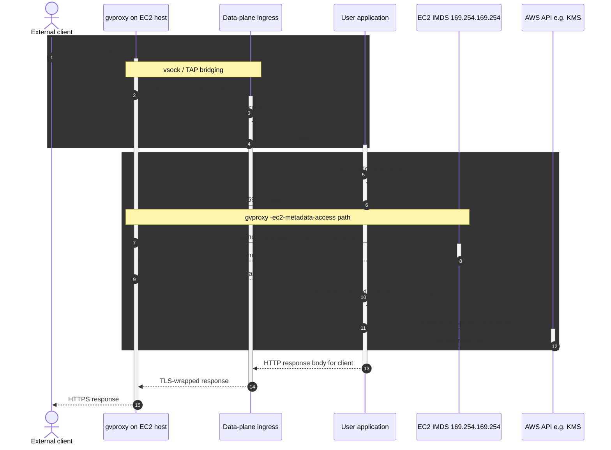
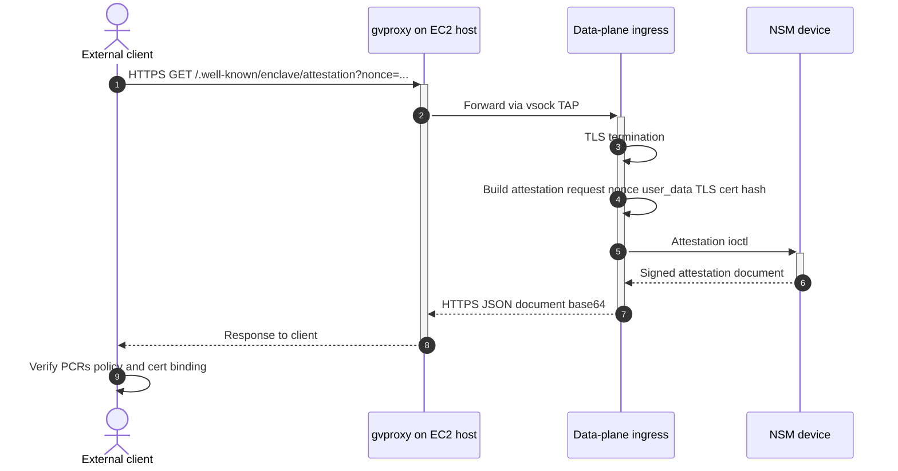
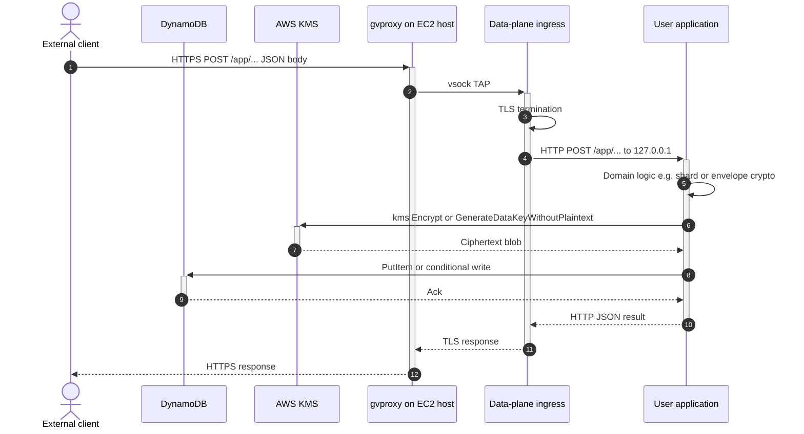
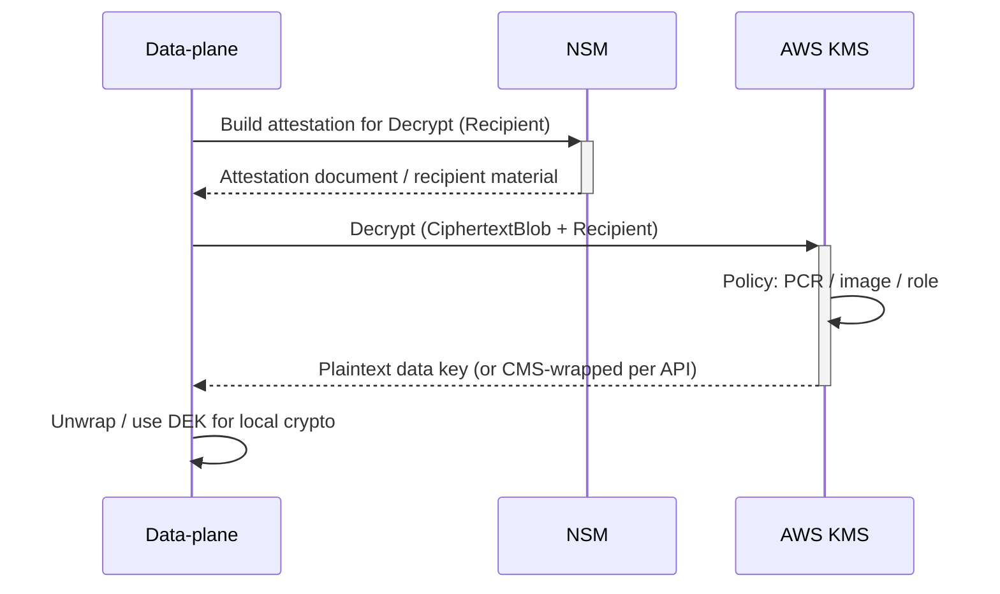
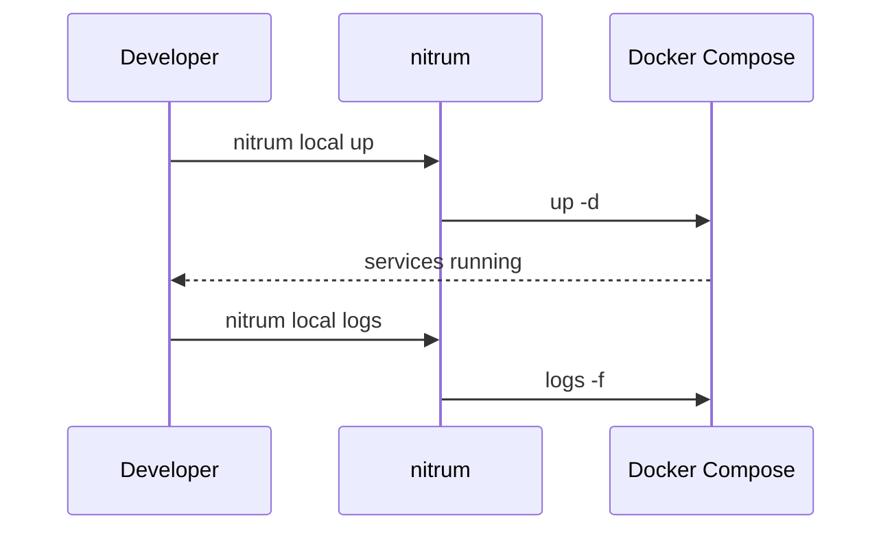
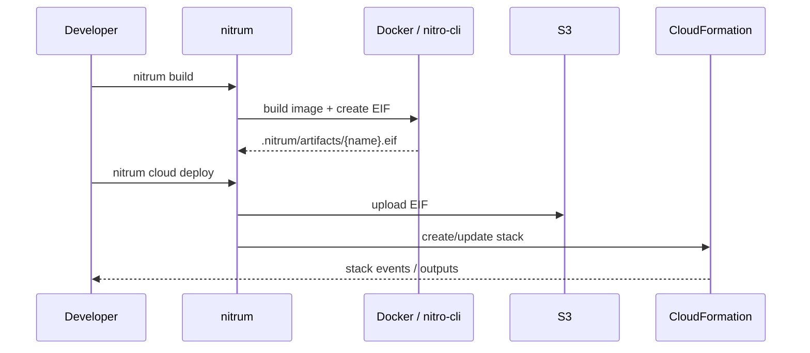

# Architecture

Nitrum is a Rust workspace for building and running workloads in **AWS Nitro Enclaves**, with a **CLI** for local development, image builds, and CloudFormation-based deployment.

## Workspace layout

| Crate / area | Role |
|--------------|------|
| **`cli` crate / `nitrum` binary** | User-facing commands: `init`, `build`, `dev`, `deploy`, `describe`, `destroy`. Orchestrates Docker, Compose, and AWS APIs. |
| **`control-plane`** | Runs on the parent EC2 instance: **gvisor-tap-vsock (`gvproxy`)** for TAP/VSOCK networking and **nitro-cli** to start the enclave with the EIF. |
| **`data-plane`** | Runs inside the enclave: loads `nitrum.toml`, wires storage/crypto, runs TLS and HTTP ingress, and hosts the application process. |
| **`shared`** | Shared configuration types (for example `nitrum.toml` deserialization). |

## High-level system context

In production, an **EIF** (enclave image file) built from your project is uploaded (for example to S3), EC2 instances pull it, and the **control-plane** container starts the enclave. Traffic reaches the **data-plane** inside the enclave according to your networking and TLS settings.

## Control plane vs data plane

The **control-plane** stays on the host: it manages **gvproxy** (VSOCK, TAP, port forwards, EC2 metadata path) and uses **nitro-cli** to run and monitor the enclave. The **data-plane** runs **inside** the enclave with restricted access; it initializes crypto and storage (KMS, DynamoDB, etc., depending on configuration), serves HTTPS, and runs your command (for example `node /app/src/main.js`).

## Control-plane and data-plane (detailed)

Other Nitro projects (for example AWS samples or stacks built on [**nitriding-daemon**](https://github.com/brave/nitriding-daemon)) often split **edge TLS + attestation HTTP** into a separate daemon and call the workload an “app.” In **Nitrum**, those responsibilities live in the **`data-plane` crate**: `server/ingress.rs` terminates TLS, exposes `/.well-known/enclave/*`, drives **ACME HTTP-01** when enabled, and **reverse-proxies** everything else to your process on `127.0.0.1` and the port from `nitrum.toml`. The **control-plane** crate on the parent only runs **gvproxy** and **nitro-cli**; it does not terminate application HTTPS.

### TLS termination and certificates

- **HTTPS (443)** is served by the data-plane **ingress** using **rustls**. Traffic from the Internet hits the EC2 host, **gvproxy** forwards it over **vsock/TAP** into the enclave, and the ingress router handles TLS.
- **Self-signed bootstrap:** On startup, `TlsState` builds an ephemeral server config for the configured domain and records a **hash of the certificate** used when minting attestation documents (see below).
- **ACME (`tls_termination.acme = true`):** A dedicated **HTTP** listener (HTTP-01) serves `/.well-known/acme-challenge/*`. The ACME client in `server/acme/` talks to **Let’s Encrypt** (or **Pebble** in local dev) over HTTPS using normal egress; issued **certificate + key** are persisted via the configured **storage** backend so renewals can **hot-reload** rustls without restarting the whole process.
- **Application traffic:** After TLS decryption, `ingress_proxy` forwards the request as **plain HTTP** to your app (`http://127.0.0.1:<service.port>…`).

### AWS credentials from inside the enclave (IMDS)

The data-plane uses an **IMDSv2** client (`utils/imds.rs`) pointed at `http://169.254.169.254/latest` (see comments there). With **gvproxy** started using **`-ec2-metadata-access`** on the parent, that address inside the enclave is routed so **role credentials** resolve the same way as on the host. The sequence is conceptually the same as the “IMDS proxy” drawings used in many Nitro walkthroughs.

### Attestation and KMS

- **Attestation:** `GET /.well-known/enclave/attestation` calls the **NSM** (`crypto/attest.rs`) and returns a **base64** document. The handler binds the document to the **current TLS certificate material** by passing the stored **cert hash** into the NSM request (so verifiers can relate attestation to what clients see on the wire).
- **KMS:** `crypto/kms.rs` uses **`GenerateDataKeyWithoutPlaintext`** for envelope material. In **enclave** builds, **`Decrypt`** uses **cryptographic attestation** (`Recipient`) per AWS’s Nitro attestation flow; the plaintext DEK never leaves the expected trust boundary.

### Reference sequence diagrams (Mermaid)

The following diagrams mirror the **IMDS credential**, **attestation**, and **KMS + durable store** flows from common Nitro/SSS-style architecture drawings. **Nitrum mapping:** *nitriding / TAP edge* → **data-plane ingress**; *sss app* → **your process** behind `ingress_proxy` (plain HTTP on `127.0.0.1`). Nitrum talks to **IMDS at `169.254.169.254`** (no separate `127.0.0.1` metadata proxy) when **gvproxy** runs with **`-ec2-metadata-access`**.

#### 1. Application traffic and IMDS credentials (reference flow)

#### 2. Attestation document (reference flow)

Nitrum exposes **`GET /.well-known/enclave/attestation`** (optional query parameters may be added later; the handler currently binds the **TLS certificate hash** into the NSM request).

#### 3. Enclave workload with KMS and DynamoDB (reference flow)

Represents patterns like **KMS encrypt / generate-data-key** plus **DynamoDB** persistence (exact routes are your app’s; Nitrum’s storage layer uses similar AWS calls with enclave credentials).

### Sequence: enclave bring-up, ACME, and readiness (Nitrum)

Simplified lifecycle on the **production** path: control-plane starts **gvproxy**, **nitro-cli** loads the EIF, **data-plane** brings up ingress and (optionally) ACME, then your app listens behind the ingress proxy.

### Sequence: KMS decrypt with attestation (envelope DEK)

## Typical flows

### Local development

`nitrum local` brings up a Docker Compose stack so you can iterate without launching a full AWS deployment. The exact topology is defined in the bundled Compose template the CLI materializes under your project.

### Build and deploy

`nitrum build` produces a Docker image and an **`.nitrum/artifacts/{project.name}.eif`** artifact using **nitro-cli** in Docker. `nitrum cloud deploy` reads `nitrum.toml`, uploads the EIF, and drives **CloudFormation** so instances can run the new image.

## Configuration

Runtime and deployment parameters live in **`nitrum.toml`** at the project root (`[project]`, `[runtime]`, service port, health checks, scaling hints, TLS, egress options). The `shared` crate defines the schema; see [usage.md](usage.md) for a short reference.

## Further reading

- [usage.md](usage.md) — CLI commands and configuration.
- [CONTRIBUTING.md](../CONTRIBUTING.md) — building and testing the workspace.
