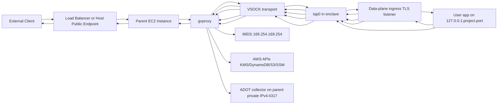
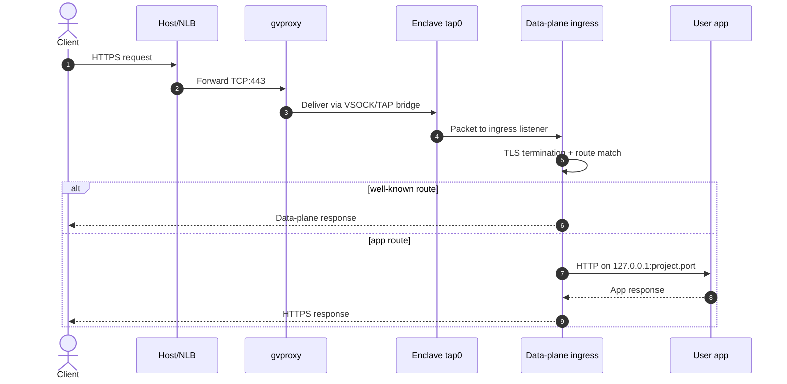
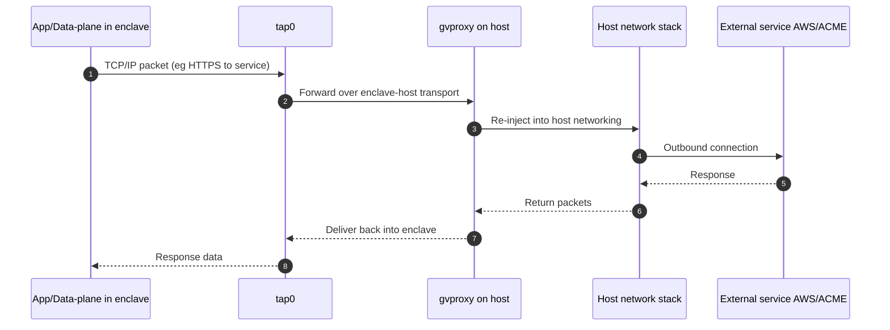
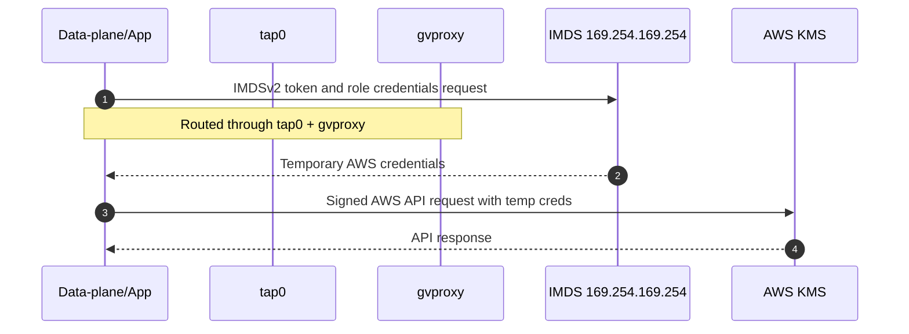
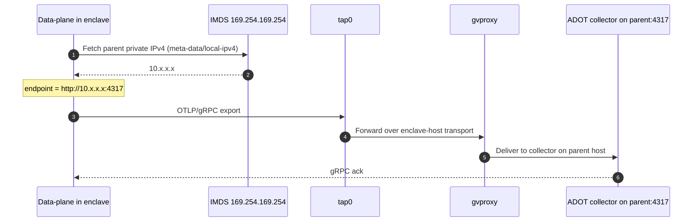

# Nitrum Networking

This document explains how networking works for a Nitrum workload running in AWS Nitro Enclaves, with emphasis on the host-side `gvproxy`, enclave-side `tap0`, and how inbound and outbound traffic move across the enclave boundary.

## Why networking is special in enclaves

A Nitro Enclave has no direct NIC and no direct Internet access. It communicates through constrained channels exposed by the parent EC2 instance. In Nitrum, the control-plane configures those channels and launches `gvproxy` to provide:

- Port forwarding from host ports to enclave services.
- Layer-3 networking for the enclave over a TAP device.
- Metadata proxy support for IMDS (`169.254.169.254`) when enabled.

Inside the enclave, the data-plane sees a regular network interface (commonly `tap0`) and can run HTTP/TLS services like a standard Linux process.

## Main components

| Component | Where it runs | Role |
| --- | --- | --- |
| `gvproxy` | Parent EC2 instance | Bridges host networking, VSOCK transport, TAP networking, and optional IMDS access into the enclave. |
| `tap0` | Inside enclave | Virtual network interface used by the data-plane for TCP/IP traffic. |
| Data-plane ingress | Inside enclave | Terminates TLS and reverse-proxies app traffic to `127.0.0.1:<project.port>`. |
| User app | Inside enclave | Handles business routes on loopback (`127.0.0.1`). |
| IMDS (`169.254.169.254`) | Host/AWS metadata service | Provides temporary IAM role credentials, proxied through host setup. |
| ADOT collector (`:4317`) | Parent EC2 instance | Receives OTLP/gRPC telemetry and exports it to CloudWatch/X-Ray. Reached by the enclave at the parent's private IPv4. |

## Topology overview

## Inbound request path (client -> enclave)

For standard HTTPS traffic:

1. A client connects to the public endpoint (for example, NLB -> EC2 host).
2. Host networking forwards traffic to `gvproxy`.
3. `gvproxy` transports packets toward the enclave over VSOCK-backed networking.
4. Inside the enclave, packets appear on `tap0`.
5. Data-plane ingress receives the request, performs TLS termination, and routes:
   - `/.well-known/enclave/*` handled by the data-plane.
   - All other paths proxied to `http://127.0.0.1:<project.port>`.

## Outbound path (enclave -> AWS and Internet services)

When the app or data-plane needs egress (for example KMS, DynamoDB, S3, ACME), traffic leaves via `tap0`, crosses `gvproxy` on the host, then exits through normal host networking.

When `[egress].enabled` is true in `nitrum.toml`, the data-plane installs in-enclave DNS and transparent TCP proxies plus iptables `OUTPUT` rules before application startup. Allowed hostnames from `destinations` (plus implicit platform allows) are resolved and relayed; blocked destinations receive NXDOMAIN or dropped TCP connections. See [usage.md](usage.md) for configuration details.

## IMDS credentials path

Nitrum commonly enables metadata access through `gvproxy`, allowing enclave software to query `http://169.254.169.254/latest` and obtain IAM role credentials (IMDSv2 flow). The endpoint is reached from inside the enclave through the same `tap0` -> host path.

## Telemetry export path (enclave -> collector)

The data-plane exports OpenTelemetry traces, metrics, and logs over OTLP/gRPC to an ADOT collector running on the parent EC2 instance. Because the enclave has no direct NIC, this export leaves via `tap0` and crosses `gvproxy` on the host, exactly like any other outbound connection.

The collector shares the control-plane container's network namespace and listens on `:4317`; CloudFormation publishes that port on the parent host (`-p 4317:4317`). The enclave cannot use the control-plane loopback address, so the data-plane discovers the parent's private IPv4 from IMDS (`meta-data/local-ipv4`) after enclave networking is up and exports to `http://{parent-private-ip}:4317`.

Endpoint resolution:

- **Unset `NITRUM_OTLP_ENDPOINT`** — use the platform default resolved from IMDS (`http://{parent-private-ip}:4317`).
- **Empty `NITRUM_OTLP_ENDPOINT`** — stdout-only; no collector is contacted.
- **Set `NITRUM_OTLP_ENDPOINT`** — export to that endpoint verbatim (overrides the IMDS default).

When `[egress].enabled` is true, the effective collector endpoint is added to the platform allowlist so telemetry is not dropped. An IP-based endpoint (the default IMDS case) is also excluded from the transparent proxy, mirroring the IMDS bypass; a hostname endpoint uses the normal DNS/pattern allow path.

See [Architecture](architecture.md) and [Usage](usage.md) for how the collector translates OTLP into CloudWatch metrics/logs and X-Ray traces.

## Local loopback vs enclave edge

Inside the enclave there are two important traffic scopes:

- Enclave edge traffic: arrives on ingress listener via `tap0` and is visible to external clients.
- Local loopback traffic: `127.0.0.1` communication between data-plane and your app (and optional internal APIs).

This split lets Nitrum keep the app interface simple (regular localhost HTTP) while keeping TLS and attestation logic at the enclave edge.

## Practical implications

- TLS is terminated inside the enclave, not on the parent host.
- `gvproxy` is a required host-side networking dependency for traffic and metadata bridging.
- If host-side `gvproxy` or port mapping is misconfigured, enclave services may be healthy internally but unreachable externally.
- If metadata access is disabled/misconfigured, in-enclave AWS SDK calls may fail due to missing credentials.
- Telemetry export also depends on IMDS: the data-plane reads the parent private IPv4 to reach the collector, so a broken metadata path degrades OTLP export to stdout-only logging.
- Networking behavior is deterministic once `tap0`, forwarding rules, and ingress bindings are stable.

## Related docs

- [Architecture](architecture.md) for control-plane/data-plane internals and cryptographic flows.
- [Usage](usage.md) for command-level deployment and runtime configuration details.
